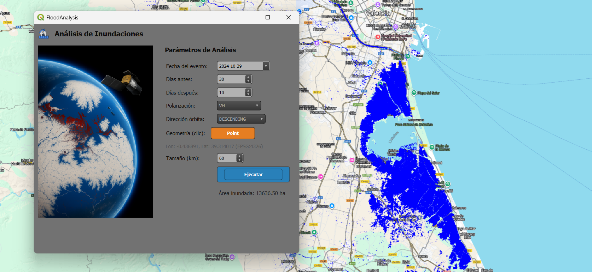

## FloodAnalysis (QGIS Plugin) 

Plugin para **QGIS 3.361** que estima y visualiza **áreas inundadas** a partir de **Sentinel-1** con un enfoque de **lógica difusa multivariable**, integra **Sentinel-2 (NDBI)**, **CHIRPS Daily (precipitación)**, **JRC-GSW (ocurrencia de agua)** y **HydroSHEDS (pendiente)**, y publica el resultado directamente como **capa XYZ** en el proyecto de QGIS.

> **Nota**: Este repositorio contiene el código del plugin y un diálogo PyQt5. Requiere autenticación correcta con **Google Earth Engine (EE)**.

---

### ✨ Funcionalidades

- 📅 Selección de **fecha del evento** y ventana **antes/después**.
- 🛰️ Configuración de **polarización (VV/VH)** y **dirección de órbita (ASCENDING/DESCENDING)** en Sentinel-1.
- 📍 Captura de **coordenadas** con un click (reproyección automática a **EPSG:4326**).
- 📦 Generación automática de **AOI cuadrada** (centro en el click, tamaño configurable).
- 🧠 **Clasificación difusa** (funciones S/Z) combinando:
  - Cambio de retrodispersión S1 (after/before).
  - Exclusión urbana con **NDBI (S2 SR)**.
  - **Precipitación CHIRPS** (filtro > 5 mm).
  - **JRC-GSW occurrence** (agua histórica).
  - **Conectividad hidráulica** vía **pendiente (HydroSHEDS)**.
  - Contexto espacial (vecindario).
- 🗺️ Publicación del binario **FloodedBin** como **XYZ tiles** en QGIS.
- 📐 Cálculo de **área inundada (ha)** dentro de la geometría dinámica.
- 🧩 Soporte de i18n (archivos `.qm` en `i18n/`).

---

